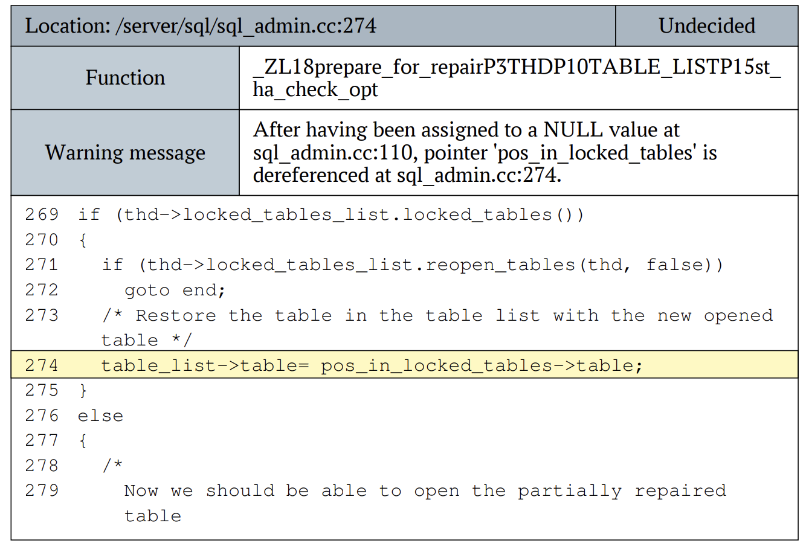

# Практическая работа 6

>Фадеев В. В.

>Файл: DEREF_OF_NULL.EX.pdf

## Задание


## Анализ уязвимости
Рассмотрит 274 строчку:
```c
table_list->table = pos_in_locked_tables->table;
```
Указатель `pos_in_locked_tables` используется для доступа к полю `table` структуры или класса. Если `pos_in_locked_tables` равен `NULL`, попытка доступа к `pos_in_locked_tables->table` приведет к ошибке выполнения.

## Исправление уязвимости
Для предотвращения эксплуатации этой уязвимости необходимо добавить проверку на `NULL` перед разыменованием указателя
```c
if (pos_in_locked_tables != NULL) {
    table_list->table = pos_in_locked_tables->table;
} else {
    // Обработка случая, когда pos_in_locked_tables равен NULL
}
```

## Вывод
На основании проведенного анализа можно сделать вывод о том, что в текущем состоянии код подвержен риску эксплуатации из-за возможности разыменования указателя `pos_in_locked_tables`, который может быть равен `NULL`. Это может привести к аварийному завершению программы или другим нежелательным последствиям.
Рекомендуется внести изменения в код для обработки случаев, когда указатель равен `NULL`, чтобы избежать потенциальных атак и обеспечить стабильность работы программы.